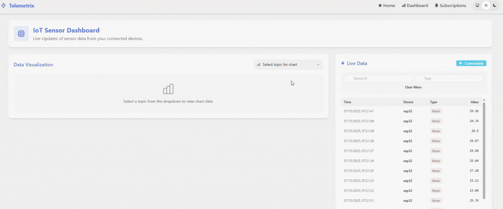

# Telemetrix

**Telemetrix** is an IoT dashboard built with Elixir and Phoenix LiveView. It's designed to run on a Raspberry Pi in your local network, providing real-time sensor data updates and MQTT subscriptions via a Mosquitto MQTT broker.

This application enables your embedded devices in your home setup to publish data that you can monitor via the Telemetrix Web App.

> Be aware of the current limitations of performance and data storage on the Raspberry Pi!

## Demo



## Features

- **Real-Time Data Visualization**: Monitor sensor data in real time using Phoenix LiveView
- **MQTT Integration**: Subscribe to MQTT topics from your IoT devices
- **Secure Communication**: TLS encryption for both web interface and MQTT connections
- **Dockerized Setup**: Easy deployment using Docker and Docker Compose
- **Ansible Automation**: Streamlined deployment to Raspberry Pi

## Planned Features & Roadmap

### Foundation & Reliability
- [ ] **Health Monitoring**: System health endpoints and connection status monitoring
- [ ] **Data Management**: Automatic data retention policies and cleanup jobs
- [ ] **Basic Alerting**: Threshold-based alerts with browser notifications
- [ ] **Data Export**: CSV/JSON export functionality for sensor data

### Advanved Features
- [ ] **Real-time Analytics**: Moving averages etc.
- [ ] **Device Management**: Interface for device registration and configuration
- [ ] **Enhanced Monitoring**: Database metrics, MQTT message rates, and system performance

### More Advanced Features
- [ ] **Time-Series Optimization**: Migration to InfluxDB/TimescaleDB for better performance
- [ ] **Device Control**: Bidirectional MQTT communication for remote device commands
- [ ] **Advanced Analytics**: Machine learning for predictive maintenance and pattern recognition

### Future Considerations
- Advanced security features
- Cloud deployment options


## Quick Start

### Local Development

For local development, you'll need:
- Elixir and Erlang installed ([installation guide](https://elixir-lang.org/install.html))
- PostgreSQL database
- Mosquitto MQTT broker
- NGINX Reverse Proxy
- Docker and Docker Compose (for containerized deployment)

1. **Clone the repository**:
```bash
git clone https://github.com/fepauly/telemetrix.git
cd telemetrix
```

2. **Install dependencies**:
```bash
mix setup
```

3. **Generate certificates**:
```bash
./scripts/generate-certs.sh
```

4. **Create a `.env` file** with your configuration (see `ansible/templates/env.j2` for reference)

5. **Start the application**:
```bash
mix phx.server
```

Visit [`https://dashboard.local:4000`](https://dashboard.local:4000) to see the application.

> Make sure the PostgreSQL database, the MQTT broker and NGINX reverse proxy are up an running. You can utilize the `docker-compose.yml` for running them in a containerized environment.

## Deployment

For Raspberry Pi deployment instructions, see [DEPLOYMENT.md](DEPLOYMENT.md).

## Project Structure

Telemetrix is an umbrella project with two main applications:
- `telemetrix`: Core application logic and MQTT client
- `telemetrix_web`: Phoenix web application for the dashboard

## MQTT Configuration

Telemetrix uses a secured MQTT broker (Mosquitto) for communication with IoT devices:
- TLS secured on port 8883
- User authentication required 
- ACL permissions for topic access control

> Make sure to create the `mosquitto_passwd` file and update the `mosquitto.acl` files according to your needs.

## License

See [LICENSE](LICENSE) for details.